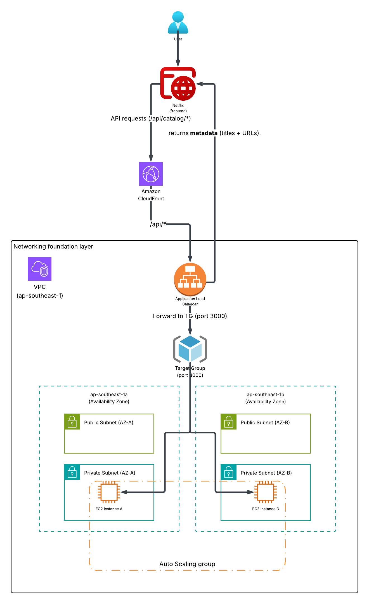
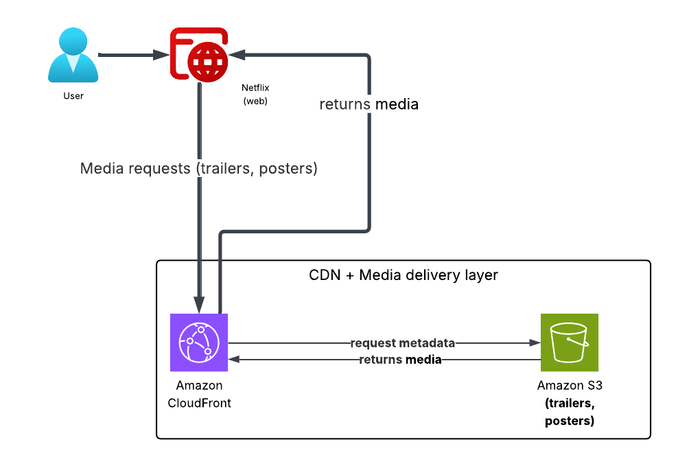

# Netflix Cloud Design with AWS

A Netflix-inspired trailer browser with a cloud-first architecture concept. This project pairs a sleek React + Vite frontend with a lightweight API contract, and includes architectural design diagrams to show how the system can scale on AWS.

## Highlights

- Netflix-style catalog UI built with React + Vite
- Clean API contract for catalog + trailer playback
- Device-aware history tracking via `deviceId`
- Architecture diagrams included for system design reference

## Architecture Diagrams

Below are the two pages of the architectural design used for this project.

  

  

## Tech Stack

- React + Vite
- JavaScript / TypeScript utilities
- Node.js backend (local dev)

## Project Structure

- `src/pages/` route-level screens
- `src/components/` shared UI components
- `src/api/` API wrappers
- `src/utils/` helper utilities
- `src/styles.css` global styles

## Run Locally

1. Install dependencies:
   - `npm install`
2. (Optional) Set the API base URL:
   - `export VITE_API_BASE_URL="http://localhost:3001"`
3. Start the dev server:
   - `npm run dev`

## API Expectations

The frontend expects the backend to expose:
- `GET /api/catalog` -> array of `{ id, title, posterUrl }`
- `GET /api/catalog/:id` -> `{ id, title, posterUrl, videoUrl }`

## Build

- `npm run build` to generate the production bundle
- `npm run preview` to serve the build locally

## Screens

- Catalog page for browsing trailers
- Watch page for playback
- History page for recently watched items
